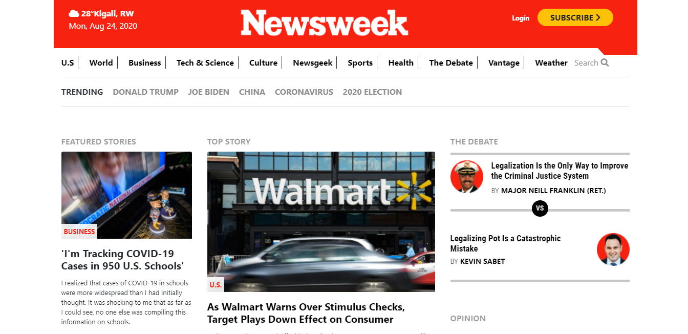

# The Newsweek page clone

The Newsweek page clone is the 7th collaborative project from the Microverse program.

## Built With :

 - HTML 
 - CSS
 - Bootstrap
 - GitHub

## Demo Link:
[You can find the project live here](https://rawcdn.githack.com/BrianSammit/Newsweek/8b4586f4f2e07379f581aceee8fbe6b92b45d2bb/index.html)

## Authors  

👤 Brian Sammit Cruz Rodriguez

Github: [@BrianSammit]( https://github.com/BrianSammit)

Twitter: [@CruzSammit](https://twitter.com/CruzSammit)

Linkedin: [Brian Sammit](https://www.linkedin.com/in/brian-sammit-cruz-rodriguez-5877551a8/)

👤 Blaise P. SHYAKA

Github: [@Blaise-Shyaka](https://github.com/Blaise-Shyaka)

Twitter: [@blaiseshyaka95](https://twitter.com/blaiseshyaka95)

Linkedin: [@blaise-pascal-shyaka](https://www.linkedin.com/in/blaise-pascal-shyaka-b1340b111/)

## 🤝 Contributing
Contributions, issues and feature requests are welcome!
Feel free to check the issues page.

## Show your support ⭐️
Give a ⭐️ if you like this project!  

## Acknowledgments
Hat tip to anyone whose code was used Inspiration etc 

## 📝 License 

This project is MIT licensed.
